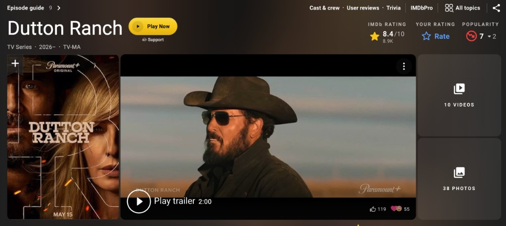
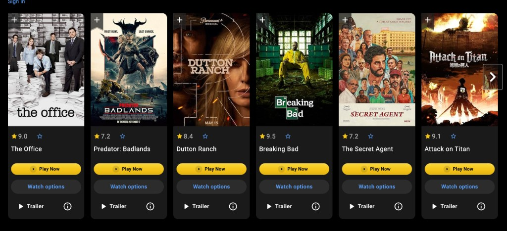
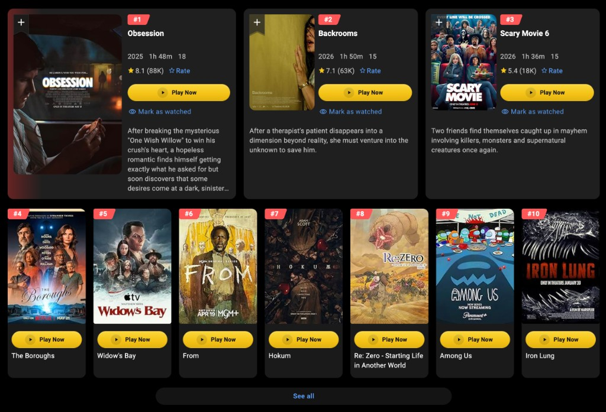
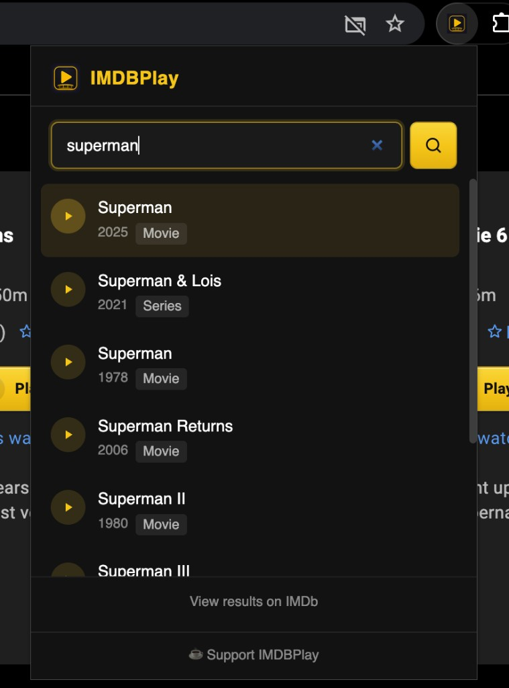

# IMDBPlay

**IMDBPlay** adds one-click **Play Now** buttons and a toolbar search popup on IMDb, then opens playback in an on-page lightbox — no tab-hopping required.

> **IMDBPlay is an unofficial fan project** — not affiliated with IMDb, Amazon, or any streaming service. The author does not host video files; playback streams from third-party players (primarily [playimdb.com](https://playimdb.com)). You are responsible for the content you watch and for complying with applicable laws in your region.

## Install

**Four steps — takes about a minute.** Works in Chrome, Brave, and Edge.

### Step 1 — Download the zip

**[Download imdbplay-v1.5.18.zip](https://github.com/ParticularCatch449/IMDBPlay/releases/download/v1.5.18/imdbplay-v1.5.18.zip)**

If that link does not work yet, open the [Releases page](https://github.com/ParticularCatch449/IMDBPlay/releases) and download `imdbplay-v1.5.18.zip` from the latest release.

### Step 2 — Unzip

- **Mac:** double-click the downloaded zip. A folder appears next to it.
- **Windows:** right-click the zip → **Extract All…**

You should have a **folder** (not a `.zip` file). Open it and confirm **`manifest.json`** is inside that folder — not buried in a parent or subfolder.

### Step 3 — Open extensions in Chrome

1. Open Chrome (or Brave / Edge).
2. In the address bar, type **`chrome://extensions`** and press Enter.  
   (Edge: **`edge://extensions`**)
3. Turn **Developer mode** **ON** (toggle in the top-right).

### Step 4 — Load unpacked

1. Click **Load unpacked**.
2. Select the **unzipped folder** from Step 2 — the folder that contains **`manifest.json`**.
3. IMDBPlay appears in your extensions list. Confirm version **1.5.18** on the card.

**Common mistakes**

| Mistake | What to do instead |
|---------|-------------------|
| Selected the **`.zip` file** | Unzip first, then select the **folder**. |
| Selected the **parent folder** (the one that still contains the zip) | Open the unzipped folder and select **that** folder. |
| Selected a **subfolder** without `manifest.json` | The folder you pick must have `manifest.json` at its top level. |

After updates: download the new zip, replace your folder, click **Reload** on the extension card, then hard-refresh open IMDb tabs.

### Chrome Web Store

_Add to Chrome from the Web Store — **coming soon**._ The store link will be added here when the listing is live.

Enjoying IMDBPlay? **[Support development on Ko-fi](https://ko-fi.com/particularcatch)** — it helps keep the project maintained.

### Developers — load from source

1. Clone or download this repository.
2. Open `chrome://extensions` (Chrome, Brave) or `edge://extensions` (Edge).
3. Enable **Developer mode**.
4. Click **Load unpacked** and select the `IMDBPlay` folder (the one containing `manifest.json`).
5. Confirm version **1.5.18** appears on the extension card.

After updates: `git pull`, click **Reload** on the extension, then hard-refresh open IMDb tabs.

| Browser | Support |
|---------|---------|
| Google Chrome | Yes (MV3) |
| Microsoft Edge | Yes (MV3) |
| Brave | Yes (MV3) |
| Firefox | Not supported (MV3 + DNR differences; would need separate packaging) |

## Features

- **Title page Play Now** — gold button on movie and TV pages, plus an optional Ko-fi support link
- **Play Now on cards** — homepage carousels, search results, charts, and lists
- **Toolbar popup search** — find a title, open its IMDb page, and start playback
- **Lightbox player** — watch without leaving IMDb; use the player controls for fullscreen
- **Ad guard** — network rules and DOM cleanup on IMDb; popup/overlay blocking on player pages
- **SPA-aware** — reinjects buttons when IMDb client-side navigation changes the page

## Screenshots

### Title page — Play Now + Support

### Homepage carousel

### Chart / list pages

### Toolbar popup search

### Lightbox player

## Support

If IMDBPlay saves you time, consider supporting development on **[Ko-fi](https://ko-fi.com/particularcatch)** — it helps keep the project maintained.

## Usage

**Popup:** click the extension icon → search → click a result.

**On IMDb:** click **Play Now** on a title or card → watch in the overlay → **X**, **Escape**, or backdrop click to close.

## FAQ

### Why are all these files public?

This is an open-source browser extension. Chrome requires readable source for **Load unpacked** installs and release zips — every file in the repo (`manifest.json`, scripts, styles, icons, and network rules) is needed for the extension to run. IMDBPlay does not host video files or store secrets in the repository; playback comes from third-party embeds.

## Permissions

| Permission | Why |
|------------|-----|
| `tabs` | Open the correct IMDb title tab when you choose a popup search result |
| `declarativeNetRequest` | Apply bundled rules to block ads on IMDb and player pages |
| IMDb hosts (`imdb.com`) | Inject Play buttons, lightbox, and on-page ad cleanup |
| Player hosts (`playimdb.com`, etc.) | Embed playback and run player ad guard |
| `v3.sg.media-imdb.com` | Public IMDb suggestion API for popup search |
| `https://*/*` | Broad host access used by player iframe/embed flows |

See [PRIVACY.md](PRIVACY.md) for what data leaves your browser.

## Project layout

| Path | Purpose |
|------|---------|
| `manifest.json` | Extension manifest |
| `popup.*` | Toolbar search UI |
| `content.*` | Play buttons, lightbox, support link |
| `imdb-adblock.*` | IMDb ad removal |
| `player-guard*.js` | Player ad/popup blocking |
| `rules/*.json` | Declarative network request rules |
| `icons/` | Extension icons |
| `docs/` | Screenshots, release, Chrome Web Store, and Reddit post guides |

## Development

- **Package a release zip:** `./scripts/package.sh` → creates `imdbplay-v1.5.18.zip`
- **Cut a release:** see [docs/RELEASE.md](docs/RELEASE.md) — or [manual steps](docs/GITHUB_RELEASE_MANUAL.md) via GitHub Desktop
- **Chrome Web Store:** see [docs/CHROME_WEB_STORE.md](docs/CHROME_WEB_STORE.md) and [docs/CHROME_WEB_STORE_FORM.md](docs/CHROME_WEB_STORE_FORM.md)
- **Reddit announcement:** see [docs/REDDIT_POST.md](docs/REDDIT_POST.md)

### Publish v1.5.18 release (GitHub Desktop)

`gh` and `git push` are not authenticated in this environment. To make the zip downloadable from GitHub:

1. **GitHub Desktop** → commit & push `README.md`, `manifest.json`, and docs → **Push origin**
2. Browser → [Releases](https://github.com/ParticularCatch449/IMDBPlay/releases) → **Draft a new release**
3. Tag **`v1.5.18`**, target **`main`**, title **`v1.5.18`**
4. Attach **`imdbplay-v1.5.18.zip`** from the project folder (run `./scripts/package.sh` first)
5. **Publish release**

Full walkthrough with screenshot callouts: [docs/GITHUB_RELEASE_MANUAL.md](docs/GITHUB_RELEASE_MANUAL.md)

## License

MIT — see [LICENSE](LICENSE).
